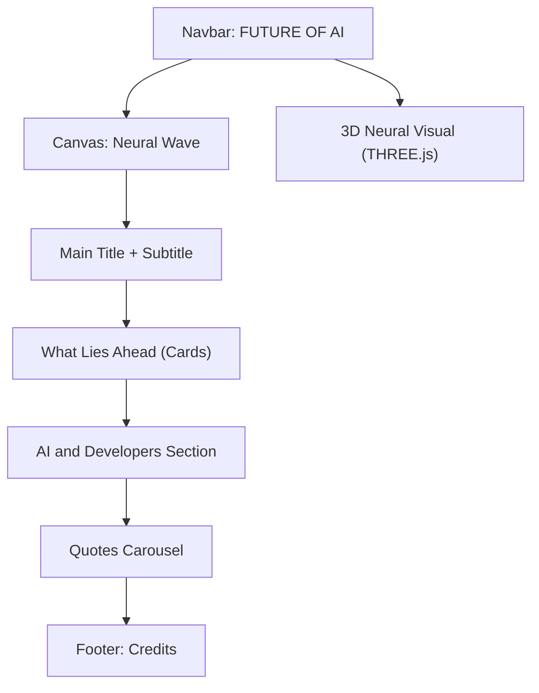
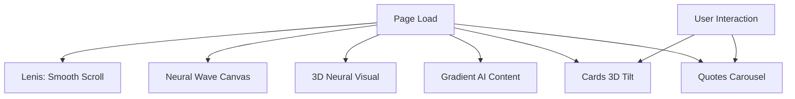

# Future Of AI – Project Documentation

This documentation provides a deep dive into the **Future Of AI** project, a visually immersive, educational website exploring the future landscape of artificial intelligence. The project is available online at [https://future-of-ai-rho.vercel.app/](https://future-of-ai-rho.vercel.app/).

---

## 🌐 Project Overview

**Future Of AI** combines interactive 2D and 3D visuals, elegant design, and curated content to inform visitors about AI’s coming decades, its impact on developers, and ethical considerations. With real-time graphics, scroll smoothing, and interactive cards/quotes, the site offers both inspiration and practical insight.

---

## Key Features

- **Animated Neural Wave**: Dynamic 2D canvas simulating neural activity.
- **3D Neural Network Visual**: Interactive 3D visualization using THREE.js.
- **Responsive, Modern UI**: Clean layouts, gradient text, and smooth transitions.
- **Quote Carousel**: Interactive carousel with quotes from AI thought leaders.
- **Animated Cards**: Informative cards with mouse-over effects.
- **Accessibility**: Fully responsive and touch-friendly design.
- **Hosted at**: [https://future-of-ai-rho.vercel.app/](https://future-of-ai-rho.vercel.app/)

---

# index.html

This is the primary HTML file responsible for the site structure, layout, and content. It embeds styles, navigation, main sections, and references external scripts.

---

## ⚙️ Structure & Main Sections

| Section class/id          | Purpose / Content                                                                                               |
|-------------------------- |----------------------------------------------------------------------------------------------------------------|
| `.navbar`                 | Fixed navigation bar with project title.                                                                        |
| `.container`              | Main content wrapper.                                                                                           |
| `.future-of-ai`           | Hero section with 2D neural wave, 3D neural visual, title, subtitle.                                            |
| `.what-lies-ahead`        | Informational cards predicting AI’s future milestones.                                                          |
| `.ai-developers`          | Discussion of AI’s impact on developer jobs and required new skill sets.                                        |
| `.quotes`                 | Carousel with inspiring/critical AI quotes and author bios.                                                     |
| `footer`                  | Copyright notice and UX suggestion.                                                                             |

---

### Navigation Bar

- **Minimalist**: Title only ("FUTURE OF AI").
- **Fixed**: Always visible at top due to `position: fixed`.
- **Gradient Text**: Title uses a linear gradient for a modern look.

---

### Hero Section: `.future-of-ai`

- **Neural Wave Canvas** (`#neuralWave`): Animated 2D sine wave mimicking neural activity.
- **3D Visual** (`#neural3d`): Placeholder for a rotating neural network rendered with THREE.js.
- **Main Title & Subtitle**: Large, gradient-filled, responsive typography introducing the site’s theme.

---

### What Lies Ahead: Cards Section

- **Informational Cards**: Four visually elevated cards, grouped into two rows, highlight these AI trends:
  - *General AI (2030s)*: Human-level reasoning, revolutionizing healthcare/education.
  - *Human-AI Symbiosis (2040s)*: Neural interfaces, direct mind-machine creativity.
  - *Creative & Ethical AI*: Art/music/literature, ethical frameworks, climate action.
  - *Responsibility Factor*: Societal impacts—bias, privacy, job displacement.

---

### Developers & AI

- **Job Impact Analysis**: Discusses automation’s threat ("25-35% of coding tasks automated by 2030") and the new opportunities for developers.
- **Emphasis on Upskilling**: Stresses adaptation, creativity, and AI tool mastery for career resilience.

---

### Quotes Carousel

- **Quote Cards**: 6 prominent quotes from AI leaders (Carmack, Karpathy, Nadella, Fei-Fei Li, Hassabis, Crawford).
- **Author Bios**: Hover reveals a short bio for each quoted expert.
- **Navigation**: Prev/Next buttons for cycling quotes.
- **Animated**: Fade and scale effects on interaction.

---

### Footer

- **Credits**: "© 2025 Future of AI | Created with curiosity"
- **UX Recommendation**: "View from desktop for the best experience"

---

## 🖌️ Design & Responsiveness

- **Custom Fonts**: Uses "Manrope" and "Roboto Slab" via Google Fonts.
- **Gradients & Shadows**: Linear gradients and subtle box shadows create depth.
- **Responsive Layout**: Multiple media queries ensure optimal appearance on mobiles, tablets, and desktops.
- **Animation**: Keyframes for fade-in and appear, smooth transitions on hover/focus.
- **Dark Theme**: Backgrounds and text colors tuned for elegant dark mode.

---

## 🌟 Interactive & Visual Elements

### Neural Wave Canvas

- `<canvas id="neuralWave">`: Visually animated using JavaScript, mimics brain waves.
- **3D Neural Network**: Rendered via THREE.js in `#neural3d`.

### Cards & Quotes

- **Cards**: Animate on hover with scaling and border color transitions.
- **Quotes**: Carousel logic switches the visible quote, and author bios fade in on hover.
- **Accessible**: Touch-friendly buttons for carousel navigation.

---

### Mermaid Diagram: Page Structure



---

## External Scripts and Libraries

- **OGL**: Modern lightweight 3D library (used for advanced visualizations, though not in script.js).
- **Lenis**: Provides smooth scrolling and scroll-related effects.
- **THREE.js**: Powers the 3D neural network visual.
- **script.js**: Main logic for animations, visuals, and interactivity.

---

# script.js

This JavaScript file orchestrates all interactive visuals, scroll smoothing, 2D/3D rendering, card animations, and quote carousel logic.

---

## 1. Smooth Scrolling with Lenis

- **Lenis Initialization**:
    ```js
    const lenis = new Lenis();
    function raf(time){
        lenis.raf(time);
        requestAnimationFrame(raf)
    }
    requestAnimationFrame(raf);
    ```
- **Effect**: Ensures a smooth scrolling experience site-wide.
- **Benefit**: Adds polish and professionalism to user navigation.

---

## 2. Neural Wave Canvas Animation

- **Setup**: Gets `<canvas id="neuralWave">` and resizes to viewport.
- **Animation Loop**: Draws a sine wave across the canvas, simulating "neural activity."
- **Responsiveness**: Resizes canvas on window changes.

### Core Drawing Logic

```js
let t = 0;
function draw() {
    ctx.clearRect(0, 0, canvas.width, canvas.height);
    ctx.beginPath();
    for (let x = 0; x < canvas.width; x++) {
        const y = canvas.height / 1.8 + Math.sin((x + t) * 0.012) * 70;
        ctx.lineTo(x, y);
    }
    ctx.strokeStyle = "rgba(67, 99, 202, 0.9)";
    ctx.lineWidth = 5;
    ctx.stroke();
    t += 1;
    requestAnimationFrame(draw);
}
draw();
```

- **Result**: Animated, gently moving blue wave in the background.

---

## 3. 3D Neural Network Visualization

- **Uses THREE.js** to render an animated, rotating 3D shape (icosahedron) with node points and connecting lines.
- **Canvas is embedded** in the `#neural3d` div.

### 3D Visual Construction

```js
const geometry2 = new THREE.IcosahedronGeometry(1, 2);
const material2 = new THREE.PointsMaterial({ color: "#9947fdff", size: 0.04 });
const points = new THREE.Points(geometry2, material2);
scene2.add(points);

const wireMaterial = new THREE.LineBasicMaterial({ color: "#4D9FFF", transparent: true, opacity: 0.7 });
const wireframe = new THREE.LineSegments(
    new THREE.WireframeGeometry(geometry2), wireMaterial
);
scene2.add(wireframe);

function animateNeural() {
    points.rotation.y += 0.002;
    wireframe.rotation.y += 0.002;
    points.rotation.x += 0.001;
    wireframe.rotation.x += 0.001;
    renderer2.render(scene2, camera2);
    requestAnimationFrame(animateNeural);
}
animateNeural();
```

- **Effect**: A softly spinning 3D "neural mesh" that visually anchors the futuristic theme.

---

## 4. UI/UX Animations

### Gradient Text Styling (for `.ai-content-points`)

- **Highlights Key Phrases** with a gradient and larger font using JavaScript.
- Makes main AI points stand out visually.

### Quotes Interactivity

- **Scale effect**: Quotes slightly grow on mouse hover.
- **Smooth Transitions**: Color and transform properties animate smoothly.

### Cards Animation

- **3D Tilt on Mouse Move**: Cards tilt based on cursor position, creating a 3D hover illusion.
- **Reset on Mouse Leave**: Card returns to original state.

---

## 5. Quotes Carousel Logic

- **Navigation**: Buttons (`prev` and `next`) cycle through quotes.
- **Active Quote**: Only one quote is visible at a time, controlled by JS class toggling.
- **Looping**: Carousel wraps around when cycling past first/last quote.

### Carousel Pseudocode

```js
let currentQuote = 0;
function showQuote(index) {
    quotes.forEach(q => q.classList.remove('active'));
    quotes[index].classList.add('active');
}
prevBtn.addEventListener('click', () => {
    currentQuote = (currentQuote - 1 + quotes.length) % quotes.length;
    showQuote(currentQuote);
});
nextBtn.addEventListener('click', () => {
    currentQuote = (currentQuote + 1) % quotes.length;
    showQuote(currentQuote);
});
```

---

## 6. Cards Interactive 3D Tilt

- **On Mouse Move**: Calculates rotation based on mouse position within the card.
- **On Mouse Leave**: Smoothly resets to flat.

---

### Mermaid Diagram: Visual/UX Logic



---

## Technology Stack

| Technology  | Purpose                      |
|-------------|-----------------------------|
| HTML5/CSS3  | Structure, responsive design |
| JavaScript  | Animations, interactivity    |
| Lenis       | Smooth scrolling             |
| THREE.js    | 3D neural network visual     |
| OGL         | (Prepared for 3D, not used)  |
| Google Fonts| Custom typography            |

---

# 🔗 Hosted Version

Explore the live site at:

**[https://future-of-ai-rho.vercel.app/](https://future-of-ai-rho.vercel.app/)**

---

```card
{
    "title": "Best Viewed on Desktop",
    "content": "The Future Of AI site delivers the richest experience with interactive 3D and animations on desktop browsers."
}
```

---

## 📝 Summary Table

| Feature                    | Source File         | Description                                      |
|----------------------------|---------------------|--------------------------------------------------|
| Responsive Layout          | index.html          | Flexible grid, cards, and typography             |
| Animated Neural Wave       | script.js           | 2D sine wave using `<canvas>`                    |
| 3D Neural Network          | script.js           | THREE.js 3D points & lines                       |
| Smooth Scrolling           | script.js           | Lenis scroll interpolation                       |
| Animated Cards             | script.js / index.html| 3D tilt, color transitions on hover            |
| Quotes Carousel            | script.js           | Prev/Next logic, author bios, transitions        |
| Theming & Gradients        | index.html / script.js| CSS & JS-applied text gradients               |

---

# 🚀 Conclusion

The **Future Of AI** project showcases a blend of modern web technologies and thoughtful curation to spark curiosity about artificial intelligence. By combining engaging visuals, interactivity, and expert content, it provides a memorable, educational experience.

For the full experience, visit: [https://future-of-ai-rho.vercel.app/](https://future-of-ai-rho.vercel.app/)

---

```card
{
    "title": "Project Takeaway",
    "content": "This project demonstrates how web animation and storytelling can powerfully communicate the future possibilities of AI."
}
```
